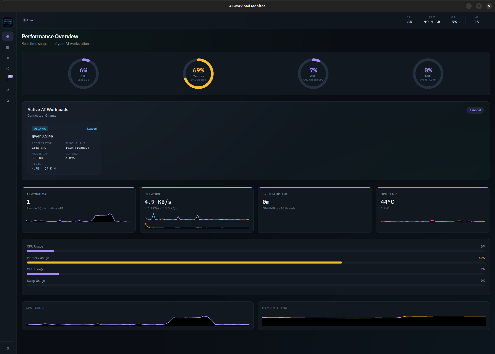
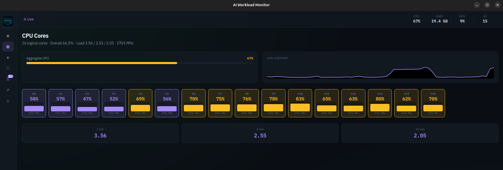
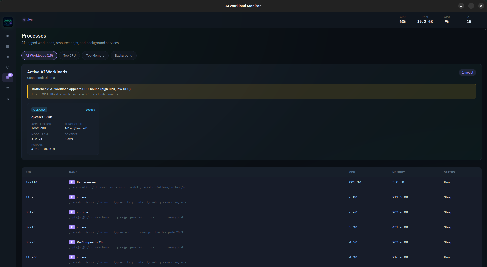

# AI Workload Monitor

Local system monitor for Linux, built for people running models on their own machine. It watches CPU, GPU, NPU, memory, processes, and network, and it recognizes Ollama and vLLM workloads in the same view.

Tauri 2 collects metrics in Rust. React renders the dashboard.

[](LICENSE)


By [Jayanta Paul](https://github.com/jayantapaul-18).

## Screenshots







## Features

- Per-core CPU, AMD GPU, and AMD XDNA NPU panels
- Memory, process, and network views, including Wi-Fi
- Active AI workloads for Ollama and vLLM, with bottleneck hints
- Hardware and runtime specs page
- Persistent settings, dark and light themes, accent colors
- Alerts in the app and as desktop notifications
- System tray with a live tooltip and a compact popup
- User install, plus `.deb`, AppImage, and RPM bundles

The full catalog is in [docs/FEATURES.md](docs/FEATURES.md). Direction after this release is in [docs/ROADMAP.md](docs/ROADMAP.md).

## Requirements

- Ubuntu 22.04 or newer (WebKitGTK 4.1)
- Rust stable, via [rustup](https://rustup.rs)
- Node.js 20.19 or newer
- Optional: a local [Ollama](https://ollama.com) or vLLM server

The UI loads IBM Plex from Google Fonts. The rest of the app works offline. Metrics never leave the machine.

## Quick start

```bash
chmod +x scripts/*.sh
./scripts/install-deps.sh   # Ubuntu/Debian packages, needs sudo
npm install
npm run tauri dev
```

## Install

Build a release and install it for the current user (app menu and `~/.local/bin`):

```bash
./scripts/install.sh
```

Start on login:

```bash
./scripts/install-autostart.sh
```

Remove the user install:

```bash
./scripts/uninstall.sh
```

`npm run tauri build` also writes installers under `src-tauri/target/release/bundle/` (`.deb`, AppImage, RPM).

## Tray

Closing the window hides the app in the tray. A left click opens the compact popup. The tray menu can show the dashboard, hide the window, or quit.

## Development

| Command | What it does |
| --- | --- |
| `npm run tauri dev` | Desktop app with hot reload |
| `npm run typecheck` | TypeScript check |
| `npm run tauri build` | Production bundles |
| `cargo test --manifest-path src-tauri/Cargo.toml` | Rust unit tests |
| `npm run commit` | Commitizen prompt (conventional commits) |

Commits are checked by a pre-commit hook (typecheck and `cargo fmt --check`) and a commit-msg hook (Commitlint). See [CONTRIBUTING.md](CONTRIBUTING.md).

```text
React UI  ←── Tauri events ──→  Rust MetricsEngine
                                    ├── /proc and /sys
                                    ├── sysinfo
                                    ├── Ollama HTTP API
                                    └── vLLM /metrics
```

Collectors sample deltas and cache static hardware info so a one-second poll stays light.

## License

[MIT](LICENSE)
